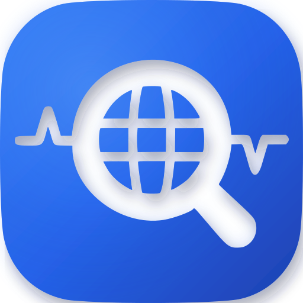

# Probing — Agent-Native Performance Analysis & Diagnosis for Distributed AI

> **Ascend NPU fork：** 若你在用华为昇腾 / MindSpeed，请先读 **[`README.NPU.md`](README.NPU.md)**（构建、环境变量、可抓字段、硬路径结论）。下文是上游通用产品说明。

<div align="center">
  

  <p>
    <a href="README.NPU.md">NPU / 昇腾</a> |
    <a href="README.cn.md">中文</a> |
    <a href="README.md">English</a>
  </p>
</div>

[](https://badge.fury.io/py/probing)
[](https://www.apache.org/licenses/LICENSE-2.0)
[](https://pepy.tech/project/probing)
[](https://codecov.io/gh/DeepLink-org/probing)

> **Give your coding agent eyes and hands inside distributed training.**
>
> Uncover the hidden truth of AI performance.

Probing is an **Agent-Native performance analysis & diagnosis tool** for distributed AI. Instead of producing flamegraphs for humans to squint at, it turns a live training job into **queryable, actionable evidence**—relational telemetry that an agent (or you) can `SELECT`, join, and act on.

It's built **from the system layer up**: zero-instrumentation probe injection, SQL-queryable telemetry, NCCL wait decomposition, and cross-node federation—so the data is structured for an agent to consume, not just for a human to read.

And it isn't yet another AI assistant. Probing **plugs into the coding agents you already use**—Codex, Claude Code, Cursor—becoming the eyes and hands they need to see inside distributed training. Skills supply diagnostic playbooks; the in-process HTTP server also exposes MCP tools at **`/mcp`** (`query`, `list_skills`, `plan_skill`, `run_skill`).

## How Probing works with your agent

Probing gives your coding agent a closed diagnostic loop over a running training job:

1. **Observe** — query live telemetry with SQL (`python.torch_trace`, `nccl.proxy_ops`, `gpu.utilization`, …).
2. **Diagnose** — run structured **skills** (`health_overview`, `slow_rank`, `nccl_culprit_victim`, …) that turn SQL evidence into deterministic findings.
3. **Act** — intervene in the live process (`eval`, `config`, inject) without stopping the job.
4. **Verify** — re-query to confirm the fix.

The moat is the system layer underneath—live injection, relational telemetry, NCCL wait decomposition, cross-node federation—the parts a thin wrapper can't fake. The agent integration is how you reach it: `./skills/install.sh` makes Probing's skills discoverable inside `.cursor/`, `.claude/`, and `.agents/`.

> **Safety:** the MCP surface is **read-only by default**—`query` / `cluster_query` accept only `SELECT`/`WITH`/`SHOW`/`DESCRIBE` with bounded result sizes. Intervention tools (`set_config`, `eval_python`) are exposed but **disabled unless you set `PROBING_MCP_ALLOW_WRITE=1`**, and every write is audit-logged. So an agent can diagnose freely, and can only mutate a live training job when you explicitly opt in.

### What probing delivers...

### 🔍 **For AI Researchers & Algorithm Engineers**
- **Debug Training Instabilities** - Real-time insight into why training diverges or hangs
- **Optimize Model Performance** - Identify bottlenecks in forward/backward passes
- **Memory Leak Detection** - Track GPU/CPU memory usage across training steps
- **Live Variable Inspection** - Check tensor values, gradients, and model states without stopping training

### 🛠️ **For Framework & Library Developers**
- **Runtime Framework Analysis** - Understand how your framework performs in real-world usage
- **Zero-Intrusion Profiling** - Profile framework internals without code modifications
- **Production Debugging** - Debug issues reported by users in their actual environments
- **Performance Benchmarking** - Collect real performance data for optimization decisions

### ⚙️ **For System Engineers & MLOps**
- **Production Monitoring** - Monitor AI services without service restarts
- **Resource Optimization** - Analyze resource usage patterns across the cluster
- **Custom Metrics Collection** - Gather any application-specific performance data
- **Distributed Debugging** - Correlate performance issues across multiple nodes

### 🚀 **Core Technical Capabilities**
- **Dynamic Probe Injection** - Attach to running processes without code changes
- **SQL-Powered Analytics** - Use standard SQL to query performance data
- **Live Code Execution** - Run Python code directly in target processes
- **Real-time Stack Analysis** - Capture execution context with variable values

### In contrast with traditional profilers, probing does not...

- **Require Code Instrumentation** - No need to add logging statements, insert timers, or modify your training scripts
- **Force "Break-Then-Fix" Workflow** - No waiting for issues to occur, then spending days trying to reproduce them
- **Lock You Into Fixed Reports** - No more deciphering pre-formatted tables; use SQL to create custom analysis reports that match your specific needs
- **Disrupt Your Workflow** - Attach to running processes without stopping your training jobs or services
- **Force You to Learn New Tools** - Use familiar SQL syntax and Python code for all your analysis needs

## Getting Started

### Installation

```bash
pip install probing
```

### Quick Start (30 seconds)

```bash
# Enable instrumentation at startup
PROBING=1 python train.py

# Or inject into running process
probing -t <pid> inject

# Real-time stack trace analysis
probing -t <pid> backtrace
```

### Use it from your coding agent

```bash
# Make Probing's diagnostic skills discoverable to Cursor / Claude Code / Codex
./skills/install.sh
```

Or connect your agent over **MCP**—point it at the probing server's `/mcp` endpoint:

```json
{
  "mcpServers": {
    "probing": { "url": "http://127.0.0.1:8080/mcp" }
  }
}
```

Then ask your agent in plain language—"this run looks stuck, find the slow rank"—and it drives Probing's skills and SQL for you (directly, or via the `run_skill` / `query` MCP tools):

```bash
probing -t <pid> skill run health_overview
probing -t <pid> skill run nccl_culprit_victim --global
```

## Core Features

- **Dynamic Probe Injection** - Runtime instrumentation without target application modification
- **Distributed Performance Aggregation** - Cross-node data collection with unified correlation analysis
- **SQL Analytics Interface** - Apache DataFusion-powered query engine with standard SQL syntax
- **Interactive Python REPL** - Live debugging and variable inspection in running processes
- **Low-Overhead by Design** - Lock-free mmap hot path and background sampling to minimize impact on the training job
- **Time-Series Storage** - Columnar data storage with configurable compression and retention
- **Real-Time Introspection** - Live performance metrics and runtime stack trace analysis
- **Advanced CLI** - Comprehensive command-line interface with process monitoring and management

## Basic Usage

```bash
# Inject performance monitoring (Linux only)
probing -t <pid> inject

# Real-time stack trace analysis
probing -t <pid> backtrace

# Query performance data with SQL
probing -t <pid> query "SELECT * FROM python.torch_trace LIMIT 10"

# Evaluate Python code in target process
probing -t <pid> eval "import torch; print(torch.cuda.is_available())"

# Interactive Python REPL (connect to running process)
probing -t <pid> repl

# RDMA Flow Analysis
probing -t <pid> rdma

# List all processes with injected probes
probing list
```

## Advanced Features

### SQL Analytics Interface
```bash
# GPU memory trend across training steps
probing -t <pid> query "
  SELECT local_step, AVG(allocated) as avg_mb
  FROM python.torch_trace
  GROUP BY local_step ORDER BY local_step
"

# Find the slowest collectives
probing -t <pid> query "
  SELECT op, AVG(duration_ms) as avg_ms, COUNT(*) as calls
  FROM python.comm_collective
  GROUP BY op
  ORDER BY avg_ms DESC
  LIMIT 5
"
```

### Interactive Python REPL

Probing provides an interactive Python REPL that connects to running processes, allowing you to inspect variables, execute code, and debug in real-time:

```bash
# Connect to a process via REPL
probing -t <pid> repl

# For remote processes
probing -t <host|ip:port> repl
```

Example REPL session:
```python
>>> import torch
>>> # Inspect torch models in the target process
>>> models = [m for m in gc.get_objects() if isinstance(m, torch.nn.Module)]
```

The REPL provides:
- **Live Variable Inspection**: Access all variables in the target process context
- **Code Execution**: Run arbitrary Python code within the target process
- **Real-time Debugging**: Set breakpoints and inspect state without stopping the process

### Distributed Training Analysis
```bash
# See all registered cluster nodes
probing -t <master> cluster nodes

# Cross-rank communication analysis via federation
probing -t <master> query "
  SELECT _role, _rank, op, AVG(duration_ms) as avg_ms
  FROM global.python.comm_collective
  GROUP BY _role, _rank, op
  ORDER BY avg_ms DESC
  LIMIT 10
"

# GPU utilization across devices
probing -t <pid> query "
  SELECT ts, mem_used_pct, gpu_util_pct
  FROM gpu.utilization ORDER BY ts DESC LIMIT 20
"
```

### Memory Analysis
```bash
# Quick memory usage overview
probing -t <pid> memory

# Memory growth trend across steps
probing -t <pid> query "
  SELECT local_step, AVG(allocated_delta) as delta_mb
  FROM python.torch_trace
  GROUP BY local_step
  ORDER BY local_step
"

# Check current CPU/GPU memory via eval
probing -t <pid> eval "
import torch, gc; gc.collect()
alloc = torch.cuda.memory_allocated()/1024**2
reserved = torch.cuda.memory_reserved()/1024**2
print(f'GPU alloc: {alloc:.0f}MB, reserved: {reserved:.0f}MB')
"
```

### Configuration Options
```bash
# Environment variable configuration
export PROBING_SAMPLE_RATE=0.1      # Set sampling rate
export PROBING_RETENTION_DAYS=7     # Data retention period

# View current configuration
probing -t <pid> config

# Dynamic configuration updates
probing -t <pid> config probing.sample_rate=0.05
probing -t <pid> config probing.max_memory=1GB
probing -t <pid> config "probing.rdma.hca.name='mlx5_cx6_0'"
probing -t <pid> config "probing.rdma.sample.rate='5'"
```

## Development

**Users:** `pip install probing` — see [Installation](docs/src/installation.md).

**Contributors** — new here? Read **[Contributing → Welcome](docs/src/contributing.md#getting-started)** (中文: [贡献指南](docs/src/contributing.zh.md#getting-started)), then:

```bash
python3 -m venv .venv && source .venv/bin/activate
pip install maturin
make develop
make check-dev
make test
```

| Doc | Content |
|-----|---------|
| [Contributing — Welcome](docs/src/contributing.md#getting-started) | Pick a track (skills / Python / docs / Rust / web), first PR |
| [Installation](docs/src/installation.md) | PyPI, wheel, `PROBING=1`, platform support |
| [Contributing — Dev setup](docs/src/contributing.md#development-setup) | `make develop`, `.pth` hook, Makefile targets |
| [examples/README.md](examples/README.md) | Optional torch/torchvision for demos |

Release wheel only: `make frontend && make wheel && make install-wheel`.

## License

[Apache License 2.0](LICENSE)
